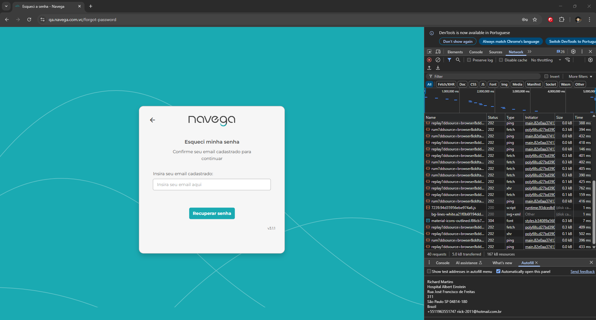

# Template de Caso de Teste

Arquivo: `/CasosDeTeste/esque-senh-case-teste.md`

| ID | Cenário | Pré-condições | Passos | Resultado Esperado | Resultado Obtido | Prioridade |
| --- | --- | --- | --- | --- | --- | --- |
| TC00001 | Realizar troca de senha | Trocar a senha com sucesso | 1. Passo | Trocar a senha | E-mail não cadastrado | Alta |

### Padrão BDD

Funcionalidade: Esquecer Senha
Cenário 1: Trocar a senha para uma nova

```

Dado que esqueci a senha 
Quando clico em esqueceu a senha? 
E preencho o campo necessário para trocar a senha
E clico em recuperar senha
Então recebo no e-mail para recuperar senha
```

Adicionar evidência: Link, Curl ,print ou vídeo (se aplicável)


---