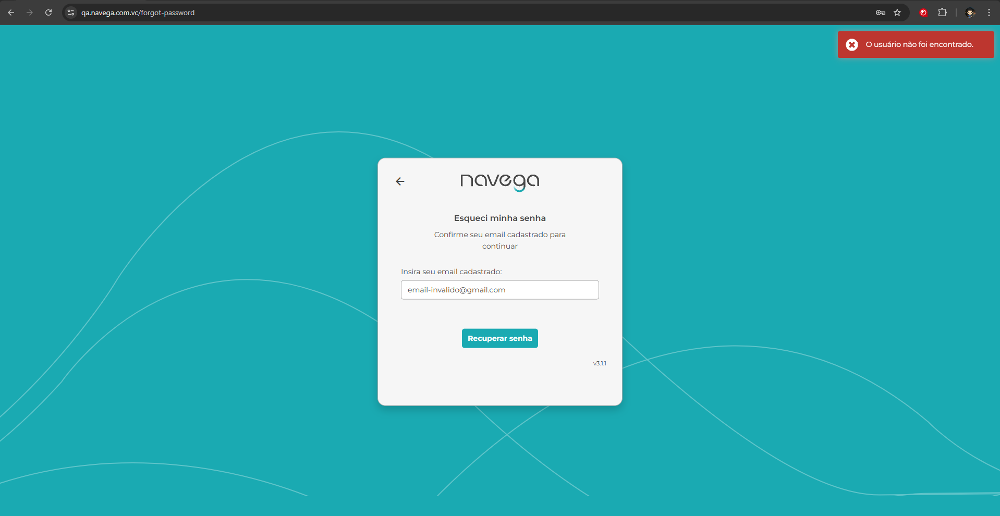

# Template de Caso de Teste

Arquivo: `/CasosDeTeste/login-case-teste-negativo.md`

| ID | Cenário | Pré-condições | Passos | Resultado Esperado | Resultado Obtido | Prioridade |
| --- | --- | --- | --- | --- | --- | --- |
| TC00002 | Não entrar | Login falhar | 1. Passo | Não logar | Não logou | Alta|

### Padrão BDD

Funcionalidade: Login falhar
Cenário 1: Realizar o login com e-mail invalido

```

Dado que entro no link 
Quando visualizo a tela de login
E preencho os campos de login e senha invalidos
E clico em acessar
Então apresenta a feedback de usuário não cadastrado

```

Adicionar evidência: Link, Curl ,print ou vídeo (se aplicável)

Link: https://qa.navega.com.vc/login
---