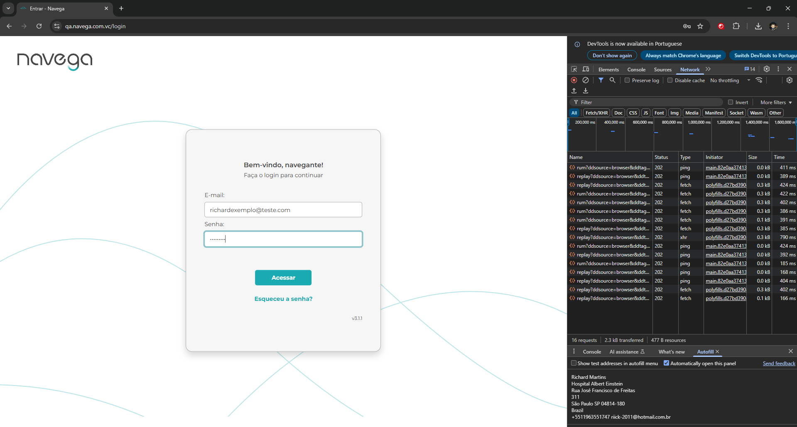

# Template de Caso de Teste

Arquivo: `/CasosDeTeste/login-case-teste.md`

| ID | Cenário | Pré-condições | Passos | Resultado Esperado | Resultado Obtido | Prioridade |
| Entrar na tela home | Não cadastrado | Alta |
| TC00001 | Realizar login | Login Sucesso | 1. Passo 
### Padrão BDD

Funcionalidade: Login
Cenário 1: Realizar o login

```

Dado que entro no link 
Quando visualizo a tela de login
E preencho os campos de login e senha
E clico em acessar
Então apresenta a tela pós login

```

Adicionar evidência: Link, Curl ,print ou vídeo (se aplicável)

Link: https://qa.navega.com.vc/login
---