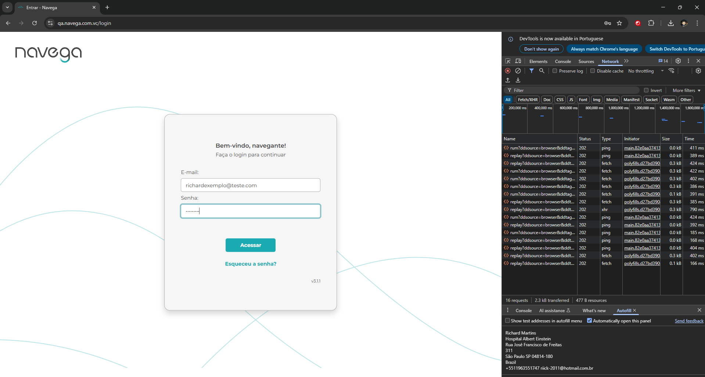

# Template de Caso de Teste

Arquivo: `/CasosDeTeste/login-case-teste.md`

| ID | Cenário | Pré-condições | Passos | Resultado Esperado | Resultado Obtido | Prioridade |
| --- | --- | --- | --- | --- | --- | --- |
| TC00003 | Realizar login | massa de teste e ambiente| 5. Passo | login sucesso | massa de teste não cadastrada | Alta | 

### Padrão BDD

Funcionalidade: Login
Cenário 1: Realizar o login

```

Dado que entro no link 
Quando visualizo a tela de login
E preencho os campos de login e senha
E clico em acessar
Então apresenta a tela pós login

```

Adicionar evidência: Link, Curl ,print ou vídeo (se aplicável)

Link: https://qa.navega.com.vc/login
---