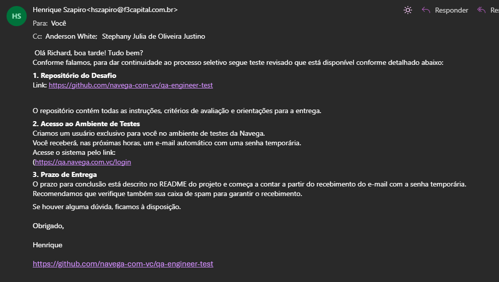

# Template de Bug

Arquivo: `/bugs-steps/email-nao-chegou.md`

**Bug:** e-mail não chegou conforme falado no e-mail

**Descrição:**

Devido o sistema ter a tela de login e não ter um botão de cadastre-se o usuário não consegue realizar o login

**Cenário de Reprodução:**

1. Dado que visualizo o e-mail
2. Quando realizo a busca
3. Então não apresenta e-mail

**Resultado Atual:**

Não chegou o e-mail então provavelmente a api não entregou conforme

**Resultado Esperado:**

api enviar o e-mail e a senha temporaria 

**Evidência:**

Link, Curl ,print ou vídeo (se aplicável)

**Hipótese Técnica:**

**Ambiente**:
QA
**Versão:**
v3.1.1
**Sistema Operacional:**
W-10
**Navegador:**
Chrome